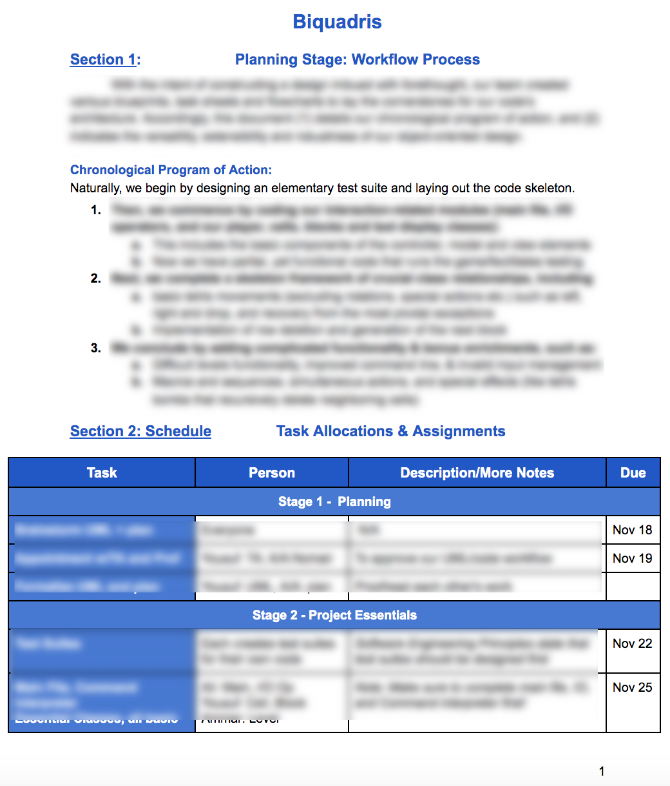
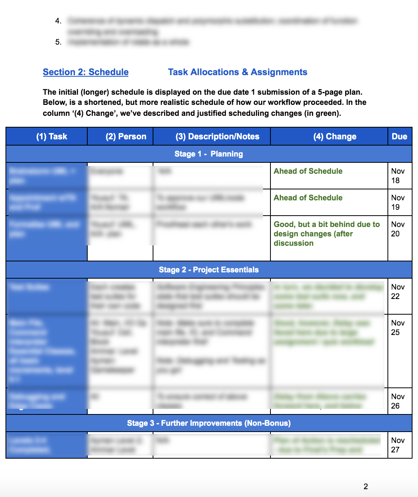
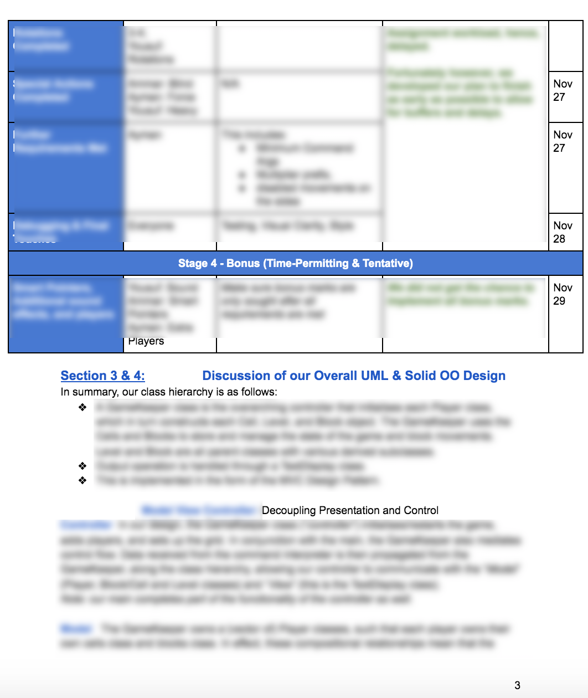
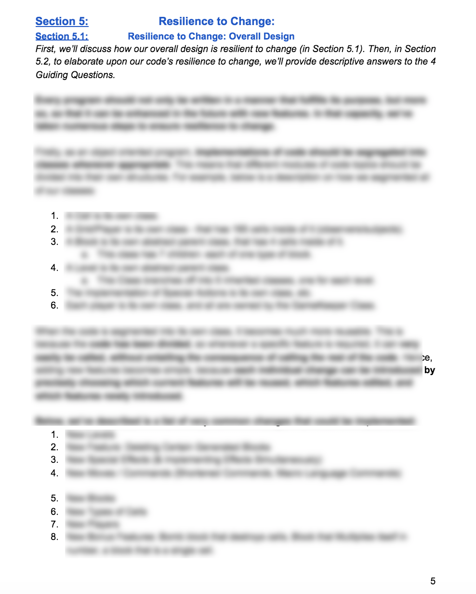
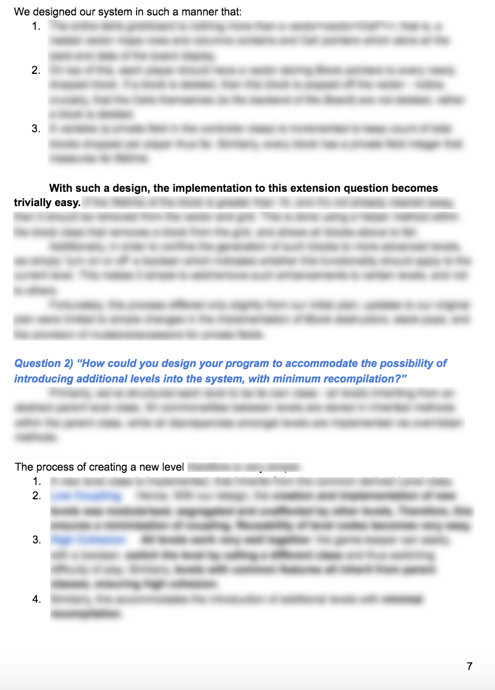
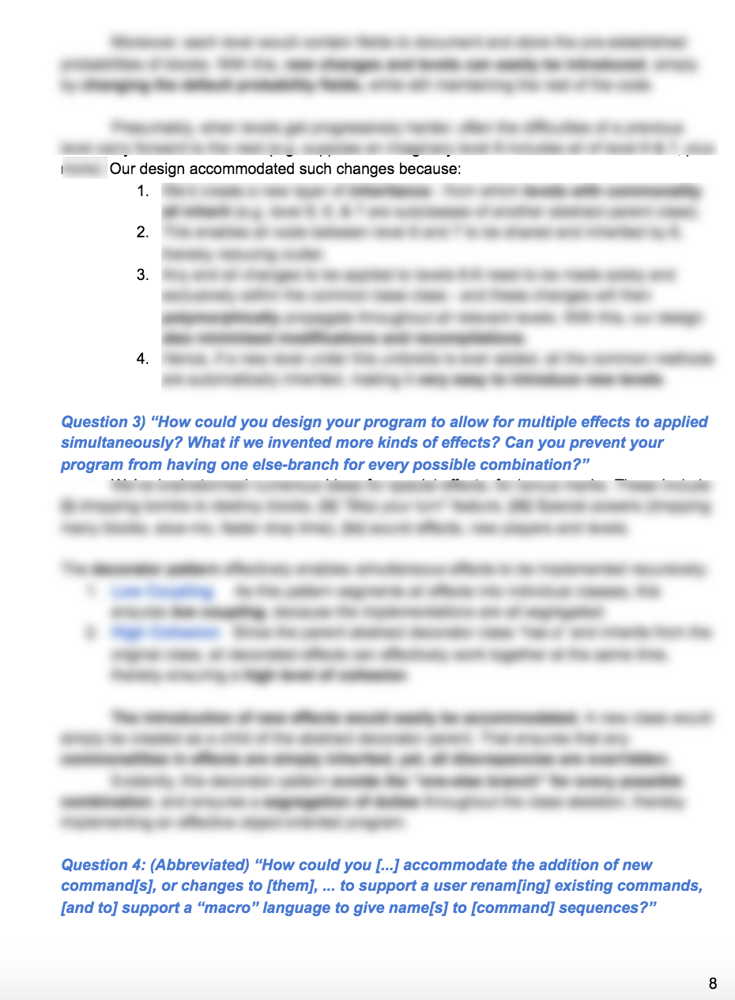
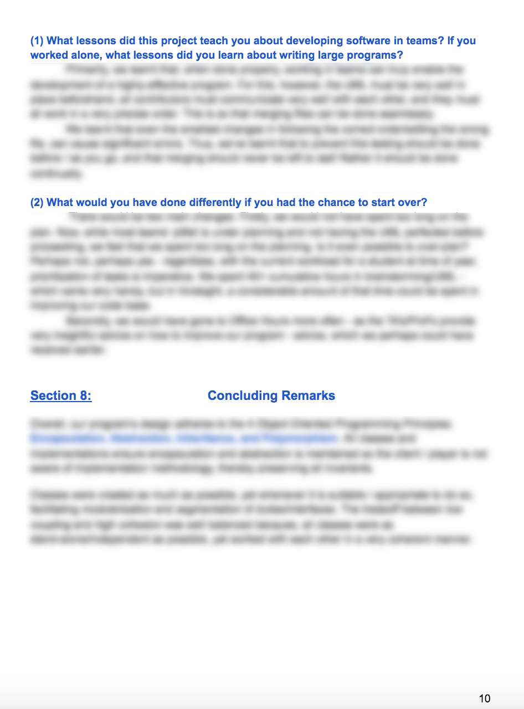

# Tetris Code Available Upon Request
** **While the code is available upon request, I have supplied the formative and summative software design work documents in this repository** **

Biquadris & Tetris are one of the most popular games in the world. Here, I have built biquadris/tetris in C++ to put into practice the centerpiece principles of the Object-Oriented Paradigm. 

This project was submitted as my group final project in my third semester at the University of Waterloo.

**Details:**
Implemented a 2-player, multi-level Biquadris game with block translation &amp; rotation functionality. 

**Design Flow:**
A GameKeeper Controller class (for control-flow mediation) propagates user-input to abstract block, cell, level and player classes, respectively; modularized through Model-View-Controller Design Pattern.

**The supplied software design documents (which have been selectively blurred for confidentiality purposes) detail the**
* project's programme-of-action, 
* object-oriented design, 
* class decomposition, 
* extensibility, 
* robustness, 
* and code flow.

# Sneak Peak into the Game Below:

# Block Movements: Down, Left, Right, Rotate Clockwise

**The formative & summative software design documents can be accessed from the Software Design directory. Snippets of them are also below**

# Formative Software Design

# Summative Software Design

